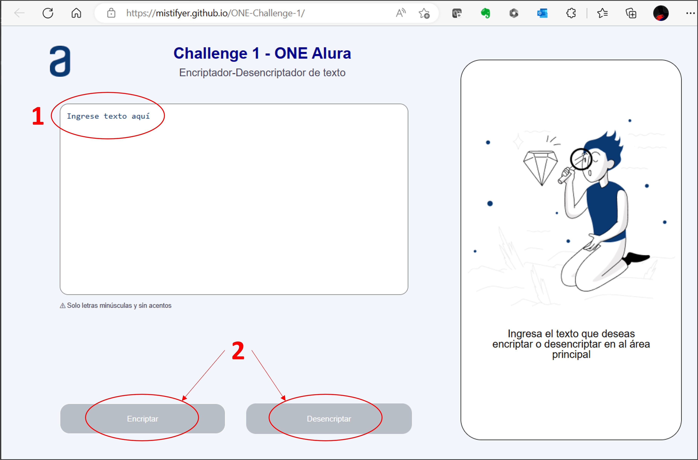

# ONE-Challenge-1

## Se trata de un codificador de texto como parte del reto de Oaracle-Alura para el grupo 4.

El objetivo de este proyecto es crear una aplicación que permite encriptar y desencriptar texto que el usuario proporcionará mediante una caja de texto o textarea y con ayuda de los botones de encriptado o desencriptado se podrá encriptar y desencriptar el texto proporcionado.  
 
  
 
### :one: Estructura principal del desarrollo.  
 
:small_orange_diamond: Se comienza por hacer la estructura HTML en el archivo principal INDEX.HTML con el HEAD y el BODY.  
:small_orange_diamond: Dentro del BODY se estructura con el HEADER, MAIN y FOOTER.  
:small_orange_diamond: En la parte superior del archivo HTML se coloca la instrucción <!DOCTYPE html> declarando la versión de HTML que usaremos.  
:small_orange_diamond: En la parte inferior del archivo HTML se colocan las etiquetas SCRIPT para colocar el nombre del archivo JavaScript  que coneitne el código de programación que tiene la funcionalidad de la aplicación.  
:small_orange_diamond: Dentro de las etiquetas de HEAD se declaran el lenguaje, el charset, el título, y se invocan los 2 archivos de estilo.  
:small_orange_diamond: Dentro de la sección de HEAD se decrara el archivo reset.css que limpia el formato predefinido y se declara ademas el archivo index.css que contiene los estilos de esta apliación.  
 

### :two: Objetos de la página INDEX.HTML.  
 
Se consulta el diseño sugerido en la web de FIGMA para determinar en general cuales son los objetos que se deben usar.  
De forma general se requieren 5 secciones definidas por DIV con los siguientes objetos:  
      
##### :arrow_right: Sección HEADER  
           --Imagen del logotipo de alura.  
           --Encabezado.  
           --Parrafo de encabezado.  
##### :arrow_right: Sección MAIN > controles-izquierdo  
           --Etiqueda de una caja de texto.  
           --Textarea para colocar contenido para encriptar y desencriptar.  
           --Párrafo con letras pequeñas.  
##### :arrow_right: Sección MAIN > botones  
           --Botón para encriptar.  
           --Botón para desencriptar.  
##### :arrow_right: Sección MAIN > contenedor-derecho  
           --Imagen de la sección del lado derecho que es un niño.  
           --Textarea para colocar el texto encriptado y desencriptado de solo lectura.  
           --Párrafo de mensaje Ningún mensaje fue encontrado.  
           --Botón de copiado.  
           --Párrafo de Ingresa el texto.  
##### :arrow_right: Sección FOOTER  
           --Párrafo con fuente H2 para el copyright.  
 

### :three: Carpeta de imagenes.  
 
Se crea una carpeta de IMAGES y se colocan las 2 imágenes que se van a utilizar en el proyecto.  
 

### :four: Formato y estilos para la página.  
 
Se crea el archivo de estilo CSS llamado index.css.  
A los objetos y secciones declarados en el archivo HTML se les assignó una CLASS para poder referenciarlos en el archivo de estilos.  
Se definen los tamaños de fuentes, Textareas, botones, colores, fondos, alineación, bordes, temaños de imagenes, etc. Con ayuda del modelo de FIGMA.  
Con ayuda del visor de herramientas del navegador Chrome se definen los MARGIN y PADDING de cada sección.  
Se declaran los objetos que inicialmente estarán ocultos como el TEXTAREA DERECHO y el BOTÓN COPIAR.  
 

### :five: Código de funcionalidad de la aplicación en JavaScript.  
 
Cabe mencionar que a los objetos declarados en el archivo HTML se les asignó un NAME y un ID para poder referencialos en el código JavaScript.  
Se comienza con la Función para encriptar de acuerdo a las recomendaciones de ALURA.  
Para hacer referencia local a objetos del HTML se utiliza la instrucción document.querySelector en la parte superior del archivo JS, asignandoles un nombre de constante local y referenciandolos por el nombre de su CLASS.  
Se observa que la función encriptar se tiene que dividir en 2 funciones, encriptarConTexto y encriptarSinTexto o cuando el texto es el mismo de Ingrese texto aquí.  
Para encriptar el texto se utiliza la recomendación que nos dieron en la última reunión de ALURA con ayuda de la instrucción replaceAll de forma anidada.  
Se hacen pruebas con los texto directo sobre los TEXTAREA.  
Se asigna el llamado de las funciones a los botones referenciandolos desde el archivo HTML.  
Dentro de las 2 funciones creadas para encriptar se incluyen instrucciones para ocultar o mostrar objetos de pendiendo del contenido en el TEXTAREA IZQUIERDO.  
Se crea la Función para desencriptar si hay texto para encriptar utilizando la misma instrucción que para encriptar llamada replaceAll pero en sentido opuesto.  
Para cuando no hay texto para desencriptar y cuando el texto es Ingrese texto aquí, se utilizan las mismas funciones que para Encriptar.  
Se crea la Función copiar y se le asigna al botón copiar con ayuda de la instrucción navigator.clipboard.writeText asignada a una variable local.  
 

### :six: Se trabaja en hacer responsiva la aplicación.  
 
Se considera la siguiente instrucción:  
meta name="viewport" content="width=device-width"  
Esta instrucción en el archivo HTML indica al navegador que adapte la página web al dispositivo que la abra.  
Y del lado del archivo CSS se utiliza @media screen and (max-width:480px).  
 

### Autor del proyecto: J. Alejandro Hernández S.  